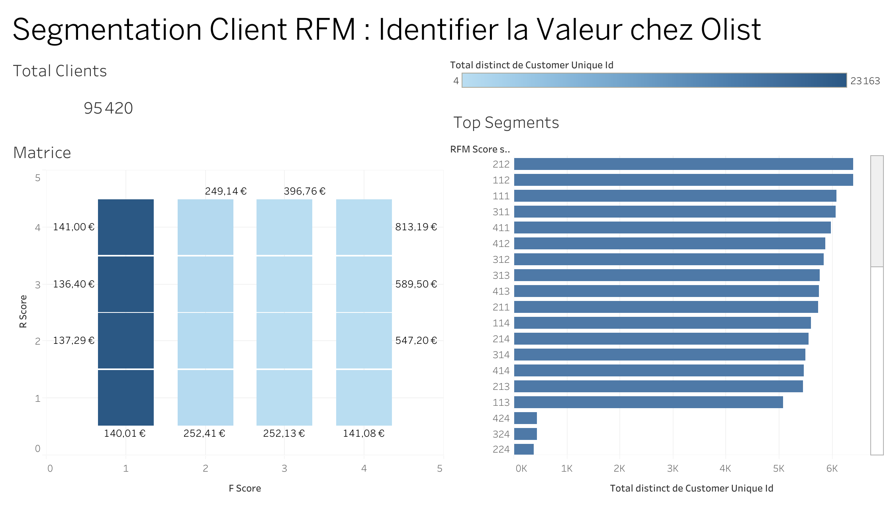

# Analyse de Segmentation et Prédiction de Valeur (CLV) pour Olist

## 1. Le Problème Business
Le département marketing de la marketplace Olist a un budget limité et cherche à optimiser ses dépenses. Pour cela, ils ont besoin de comprendre en profondeur leur base de clients :

Qui sont nos meilleurs clients ? (Champions)

Qui sont les clients "à risque" ou "perdus" ?

Sur quels clients devrions-nous concentrer nos efforts marketing pour maximiser le revenu futur ?

## 2. L'Objectif Analytique (Le Plan en 2 Phases)
Ce projet vise à fournir une stratégie de segmentation actionnable, basée sur la donnée.

### Phase A : Segmentation RFM (SQL)

Construire une table "maître" au niveau client en joignant 8 tables (commandes, produits, clients...) via SQL.

Calculer les scores de Récence, Fréquence et Monétaire (RFM) pour chaque client.

Créer des segments clairs (ex: "Champions", "Clients à Risque", "Nouveaux").

### Phase B : Modélisation Prédictive (Python & Scikit-learn)

Utiliser la table "maître" de la Phase A comme base pour le "feature engineering".

Construire un modèle de Régression (Linéaire ou Random Forest) pour prédire la Customer Lifetime Value (CLV) future (ou la probabilité de prochain achat).

## 3. Les Données
Source : [Olist E-Commerce Dataset (Kaggle)](https://www.kaggle.com/datasets/olistbr/brazilian-ecommerce)

Format : Une base de données relationnelle simulée (~100k commandes) répartie sur 8 fichiers CSV principaux (ex: orders, customers, order_items, products...).

## 4. La Solution : Segmentation RFM (Tableau Dashboard)
Nous avons segmenté les 95 000+ clients selon trois axes : Récence, Fréquence, Montant.

### Insights Clés :

* La valeur est concentrée : Les clients "Champions" (Score 444) ont un panier moyen de 813€, contre 140€ pour les clients inactifs.

* Problème de Rétention : Plus de 90% des clients n'ont effectué qu'un seul achat (Fréquence = 1), rendant la fidélisation prioritaire.

[Voir le Dashboard Interactif](https://public.tableau.com/shared/4FQXTC6D9?:display_count=n&:origin=viz_share_link)

## 5. Démarche Technique (SQL & Python)

### Phase A : Engineering des Données (SQL Avancé)
Les données étaient réparties dans 8 tables relationnelles. Une table unique "Client" a été construite via SQL :

Utilisation de `JOIN` multiples pour lier `customers` -> `orders` -> `order_items`.

Agrégation complexe (`GROUP BY`, `MAX` date, `COUNT` distinct) pour calculer les indicateurs R, F et M bruts.

### Phase B : Segmentation & ML (Python)
* Segmentation : Création des scores 1-4 avec `pd.qcut` (pour R et M) et règles manuelles (pour F).

* Tentative de Prédiction (Machine Learning) :

    * Objectif : Prédire si un client sera "High Value" (M=4) en utilisant uniquement sa Récence et Fréquence.
    
    * Modèle : Régression Logistique (Scikit-Learn).

    * Résultat : Accuracy 76% (similaire à la baseline).

    * Conclusion : La Récence et la Fréquence seules ne suffisent pas à prédire la valeur monétaire future. Il est nécessaire d'enrichir les données (catégories produits, géolocalisation) pour un modèle performant.

## 6. La Stack Technique (Nos Outils)
* SQL (SQLite) : Jointures, Agrégations, CTEs.

* Python : Pandas (Nettoyage), Scikit-learn (Logistic Regression).

* Viz : Tableau.